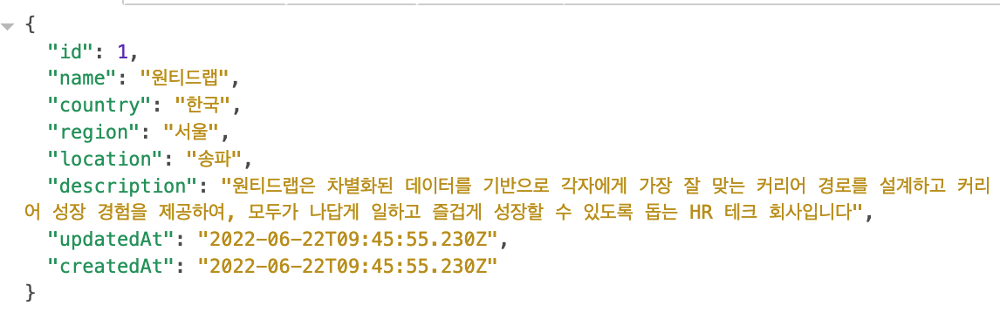
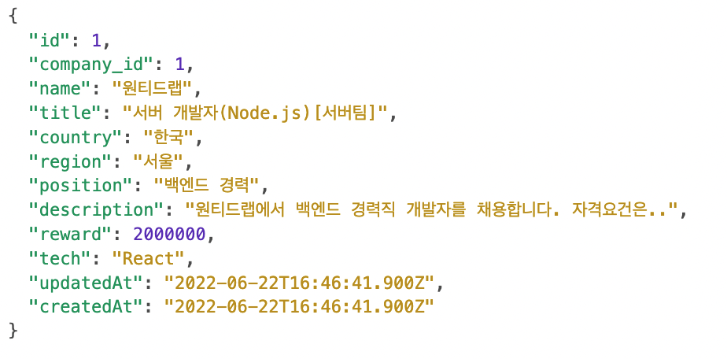
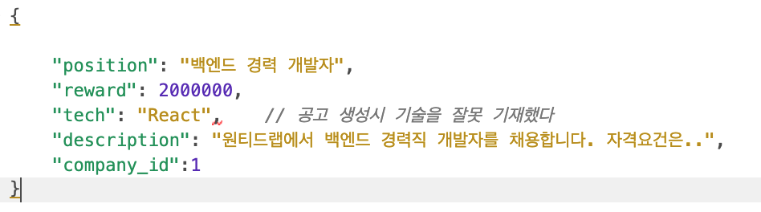
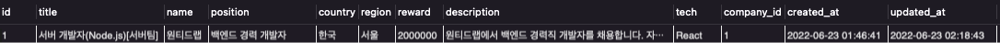
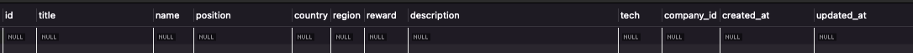

# wanted_pre_onboarding

---

 

### 원티드 프리온보딩 백엔드 선발과제

 

##### 1.과제안내

- 기업채용을 위한 웹서비스의 요구를 만족하는 `REST API` 서버를 구현하라
- [서버의 주요기능]: 회사는 채용공고를 생성하고, 이에 사용자는 지원한다
   

- 사용한 언어와 프레임워크

  - `Javascript - Node.js(Express)`
     

- IDE
  - `VS CODE`
     
- API Testing Tool
  - [Insomnia](https://insomnia.rest/)

##### 2.평가및 가산요소 [링크는 참조]

- REST API
- ORM : Sequelize
- RDBMS : Mysql
- 요구사항 구현
- 모델링
- 코드 가독성 및 코드 컨벤션
- 가산점 포함된 요구사항
- Unit Test
- [Git commit 메시지 컨벤션](https://overcome-the-limits.tistory.com/entry/%ED%98%91%EC%97%85-%ED%98%91%EC%97%85%EC%9D%84-%EC%9C%84%ED%95%9C-%EA%B8%B0%EB%B3%B8%EC%A0%81%EC%9D%B8-git-%EC%BB%A4%EB%B0%8B%EC%BB%A8%EB%B2%A4%EC%85%98-%EC%84%A4%EC%A0%95%ED%95%98%EA%B8%B0)
- README에 요구사항 분석 및 구현 과정 작성

 

#### 3.문제 출제 의도와 요구사항 분석

`백엔드 개발자`로서 현업에서 기본적으로 많이 만들어볼 `Rest API` 서버를 만들어보면서 빠르게 진행될 코스과정과 실무에 적응할 인재인지 확인하기 위함으로 판단

요구사항 중 있어야할 모델인 `회사`,`공고`,`유저`,`지원내역` 등의 모델링과 각 테이블간의 관계를 분석하여 직접 `ERD`를 만들어보고, `ORM`을 사용하여 단순 로우쿼리 요청이 아니라, 현업에서 많이 사용하는 `ORM` 등의 쿼리 규칙에 따라 직접 `CRUD` 요청을 해보며 익숙해져라 라고 판단

 

---

### ERD(Entity Relationship Diagram)

 </img>

 

---

## 모델 상세 설명

 

### 1. companies 회사

 

| 번호 |  칼럼이름   |    설명     |  타입   | 특정키 |   null   |      그외      |
| :--: | :---------: | :---------: | :-----: | :----: | :------: | :------------: |
|  1   |     id      |  회사의 id  | INTEGER |   PK   | Not Null | auto_increment |
|  2   |    name     |   회사명    | STRING  | UNIQUE | Not Null |
|  3   |   country   |    국가     | STRING  |        |   Null   |
|  4   |   region    | 지역(시/도) | STRING  |        |   Null   |
|  5   |  location   | 위치(구/동) | STRING  |        |   Null   |
|  6   | description |  회사설명   |  TEXT   |        |   Null   |

회사에는 `이름`, `국가`, `지역`, `위치`, `회사에 대한 설명`등 이 있다

 

[CRUD 구현]
과제구현 조건 중:

> 회사의 데이터는 DB에 임의로 생성하여 진행한다

 

#### 1. 회사 생성

- 회사 생성 요청
  `POST`: `/company/addCompany` 

 

- 회사 생성 응답   `200 OK` 
  

 
 

[특이사항 & 구현하면서 느낀점]

 

처음 계획은 회사생성시 `id`는 따로 `unique`한 `company_id`로 지정하려고 하였는데, 실제 서비스하는 곳에서는 어떠한지 알아보는 과정에서 `원티드`나 다른 채용사이트에서 의외로 회사id를 다루는 방식이 `company/id` 와 같은 방식인 것을 확인했다

예를들어 원티드의 company/1 은 [퓨쳐스트림네트웍스(FSN)](https://www.wanted.co.kr/company/1)이다
원티드랩의 회사 번호는 [79](https://www.wanted.co.kr/company/79)번이다

선별과제가 실제에 입각하여 낸 문제 같다는 생각이 문득 들었었다

 

---

 

### 2. recruits 채용공고

 

| 번호 |  칼럼이름   |     설명     |  타입   | 특정키 |   null   |      그외      |
| :--: | :---------: | :----------: | :-----: | :----: | :------: | :------------: |
|  1   |     id      | 채용공고 id  | INTEGER |   PK   | Not Null | auto_increment |
|  2   |    title    | 채용공고제목 | STRING  |        | Not Null |
|  3   |    name     |    회사명    | STRING  |        | Not Null |
|  4   |   country   |     국가     | STRING  |        |   Null   |
|  5   |   region    | 지역(시/도)  | STRING  |        |   Null   |
|  6   |  location   | 위치(구/동)  | STRING  |        |   Null   |
|  7   |  position   |  채용포지션  | STRING  |        |   Null   |
|  8   |   reword    |  채용보상금  | INTEGER |        |   Null   |
|  9   |    tech     |   사용기술   | STRING  |        |   Null   |
|  10  | description |   채용설명   |  TEXT   |        |   Null   |
|  11  | company_id  |  회사의 id   | INTEGER |   FK   |   Null   |

 

`recurits`에는 `공고제목`,`이름`, `국가`, `지역`, `기술`,`보상금`,`회사에 대한 설명`,`회사id`등 이 있다

`recruits`는 `companies`와 `N:1`의 관계이다
`회사`는 `여러개의 공고`를 올릴 수 있다

[CRUD 구현]

- 채용공고 `생성`
- 채용공고 `수정`
- 채용공고 `삭제`
- 채용공고 `검색`
- 채용공고 `상세히보기` \* 채용공고를 올린 회사가 올린 `다른 공고도 같이 보기`
   

#### 1. 채용공고 생성

- 채용공고 생성 요청
  `POST`: `/recruit/addRecruit` 

 

- 채용공고 생성 응답   `200 OK` 
  

[특이사항 & 구현하면서 느낀점]

채용공고 생성도 마찬가지로 `id`는 따로 `unique`한 `recruit_id`로 지정하려고 생각했었고, 실제 서비스하는 곳에서는 어떠한지 알아보는 과정에서 `원티드`를 기준으로 `recruit/id` 와 같은 방식인 것을 확인하였다

예를들어 `원티드`의 `company/id=1`인 `퓨쳐스트림네트웍스(FSN)`의 채용공고 중의 하나의 id는 [21](https://www.wanted.co.kr/wd/21)이다 삭제된 다른 링크에 비해 아직도 살아있는게 신기하다

원티드랩의 서버개발자 채용공고 id는 [106455](https://www.wanted.co.kr/wd/106455)번이다

id가 10만이 넘은 것을 봐서는 엄청나게 많은 회사들이 원티드랩의 서비스를 이용한 것 같다

#### 2. 채용공고 수정

- 채용공고 수정 요청
  `PUT`: `/recruit/:id` 

 
 

- 채용공고 수정 응답   `201 Created` 
  
  

 
 

[특이사항 & 구현하면서 느낀점]

 

사실상 가장 오류가 많았던 부분이었다
선별과제를 단순하게 풀 수도 있었겠지만, 머리속에서 완벽해야한다는 생각이 들어

1. `공고 id가 없는데 요청하는 경우` (공고 생성이 안되었는데, /recruit/:id로 요청한경우)
2. `임의로 company_id를 변경하려고 하는 경우`
3. `회사의 db를 가져와 join해서 가져온 회사 id와 요청하는 회사 id를 매칭해서 다르면 수정을 허용하는 경우` 등

여러가지 경우를 생각해 놓고 이렇게 저렇게 풀어 보느라 시간을 많이 허비했다.
기본적인 수정기능은 구현하였으나 개인적으로는 만족스럽지 않았다

또한 요청시에 `PATCH`가 아닌 `PUT` 요청을 보냈는데, `PATCH` 요청의 경우 보내지지 않은 정보에 대해 기존데이터를 유지하는 방식이고, 이것을 생각해보면 내 개인 정보 수정시에 적었다가 빈칸으로 다시 남기고 싶은 정보들이 있을 텐데 이게 계속 유지가 된다면 기능적으로 좋지 못하다고 생각하여 `null`을 반환해주는 `PUT` 요청을 사용하였다

#### 3. 채용공고 삭제

- 채용공고 삭제 요청
  `DELETE`: `/recruit/:id` 

 

- 채용공고 삭제 응답   `200 OK` 
  

 

[특이사항 & 구현하면서 느낀점]

 

크게 어려웠던 점은 없었지만, 현업에서 일하는 분 얘기를 들어보면 `UPDATE/DELETE` 요청도 `POST`로 처리하는 것이 보안적으로 좋다고 들었는데, 온보딩에 참여하게 되면 직접 실무에서의 `RESTFUL`한 서버처리 방식을 보고 싶다

#### 4. 채용공고 검색

- 채용공고 검색 요청
  `GET`: `/recruit/search/:keyWord` 

  1. /recruit/search/react
     

  2. /recruit/search/Node
     

 

- 채용공고 검색 응답   `200 OK` 

 

[특이사항 & 구현하면서 느낀점]

 
 

url요청 보내는 부분도 과제제출 기한이 끝나고 보니 아쉬운 부분이었다
원티드에서 검색필터를 어떻게 하는지 확인한 후 비슷하게 구현해 보려고 하였으나
코드를 망치는 결과여서 선별과제 예제 처럼 간단하게 필터를 작성하였다

원티드에서의 채용공고 필터는 이러하다

`개발직군`, 국가:`한국`, 경력:`전체`, 지역:`전체`
`wdlist/518?country=kr&job_sort=job.compensation_order&years=-1&locations=all`

`개발직군`, 국가:`한국`, 지역:`서울`, 경력:`신입-1년`, 포지션:`서버개발자`,`Node.js`, 기술스택:`Node.js`,`React`
`wdlist/518?country=kr&job_sort=company.response_rate_order&years=0&years=1&skill_tags=1547&skill_tags=1469&selected=895&selected=872&locations=seoul.gangnam-gu`

여러개를 보니까 패턴은 이렇구나 하는데, 막상 구현해 보려고 하면 꽤 복잡할 것 같다는 생각이 들었고, 저런 tags=num 에 붙는 고유번호를 정하는 기준도 궁금했다.
언제 시간이 나면 개인적으로 검색쿼리 미니 프로젝트를 만들어봐야겠다

 

---

 

#### 5. 채용공고 상세히 보기

 

- 채용공고 상세히 보기 요청
  `GET`: `/recruit/detailPage/:id` 

 

- 채용공고 상세히 보기 응답   `200 OK` 

  

   

[특이사항 & 구현하면서 느낀점]

 

역시 시간이 부족해서 디테일을 신경쓰지 못한 것이 아쉽다
회사 이름 등을 출력하지 못한 것도 아쉽다
특히 회사가 올린 공고 전부를 가져오면서 companiesRecruit의 공고 id당 title도 가져오고 싶었는데 시간이 부족했고,
예상치 못하게 model에 설정해뒀던 unique키 등 및 서버 충돌 에러 등이 생겨서 곤란했었다.

recruit 기능구현이 사실상 핵심인데

머리속에 여러가지 방법에 대한 생각만 많아서 정리가 안된 채 코드 작성했던 것도 아쉬웠다

특히 컨트롤러를 작성하면서 코드가 길어져, 유지보수를 위해 각 기능별 폴더/파일을 따로 만들까도 했는데, 폴더 이동시 github에 commit 히스토리가 사라지는 이슈가 있어 커밋 컨벤션도 평가에 들어가기 때문에 쉽게 선택을 못하였다. 지인 개발자 분과 얘기를 나누던 도중에
"개발 사이즈가 크지 않으면 그냥 한 파일에 작성해도 괜찮을 것 같다" 라는 의견을 주셔서 최대한 주석을 작성하며 파일 하나에 작성하기로 하였다

 

---

### 3. users 사용자

 

| 번호 | 칼럼이름 |    설명     |  타입   | 특정키 |   null   |      그외      |
| :--: | :------: | :---------: | :-----: | :----: | :------: | :------------: |
|  1   |    id    | 사용자의 id | INTEGER |   PK   | Not Null | auto_increment |
|  2   |   name   |    이름     | STRING  |        | Not Null |
|  3   |  phone   |  전화번호   | STRING  |        |   Null   |
|  4   |   age    |    나이     | INTEGER |        |   Null   |
|  5   |  email   |   이메일    | STRING  |        | Not Null |
|  6   |  career  |    경력     | STRING  |        |   Null   |

사용자에는 `이름`, `전화번호`, `나이`, `이메일`, `경력`등 이 있다

보통 이메일을 아이디로 사용하기때문에 이메일은 반드시 존재해야하며, 전화번호는 개인정보로 인해 따로 적지 않는 사람도 있으므로 고민하다가 null로 설정하였다

#### 1. 유저 생성

- 유저 생성 요청
  `POST`: `/user/addUser` 
  
   

- 유저 생성 응답   `200 OK` 

---

### 4. applicants 지원(내역)

| 번호 |  칼럼이름  |    설명    |  타입   | 특정키 |   null   |      그외      |
| :--: | :--------: | :--------: | :-----: | :----: | :------: | :------------: |
|  1   |     id     | 지원내역id | INTEGER |   PK   | Not Null | auto_increment |
|  2   | recruit_id |    이름    | STRING  |   FK   | Not Null |
|  3   |  user_id   |  전화번호  | STRING  |   FK   | Not Null |

지원 내역은 사용자와 N:1관계이다
지원 내역은 채용공고와 N:1관계이다

사용자는 여러개의 공고에 지원할 수 있고, 어느어느 기업에 지원했는지 지원 내역을 확인 할 수 있다
회사는 채용공고을 올려 지원 내역을 통해 어떤 사람들이 지원했는지 확인 할 수 있다

#### 1. 채용공고 지원

- 채용 공고 지원하기
  `POST`: `/applicant/apply` 
  
   

- 채용 지원 응답   `200 OK` 

[특이사항 & 구현하면서 느낀점]

 

원래 의도는 유저의 이름 및 이메일 등을 통해 지원할 예정이었으나 시간 부족으로 하지 못하였다
클라이언트 부분에서 직접적으로 recruit_id, user_id를 요청하면 가능하겠으나, 그렇게 되면
보안적으로 좋지 않을 거라 생각한다
이후에 지원함에 따라 지원했음을 알리는 칼럼이나 카운트를 통해 같은 공고에 이중지원이 안되게 하려고 하였다

 

#### 2. 채용공고 확인

 

- 지원한 공고 확인하기[미완]

  `GET`: `/applicant/:id` 

  
   

  [특이사항 & 구현하면서 느낀점]
   
  일단 지원내역은 하나만 나오는 것으로 확인 된다
  원인은 모델에서 findOne을 통해 컬럼들을 가져올 때 계획을 잘 못 짠 것 으로 생각된다

  다음에는 유닛테스트를 학습해서 하나하나 테스트하면서 진행하려한다
